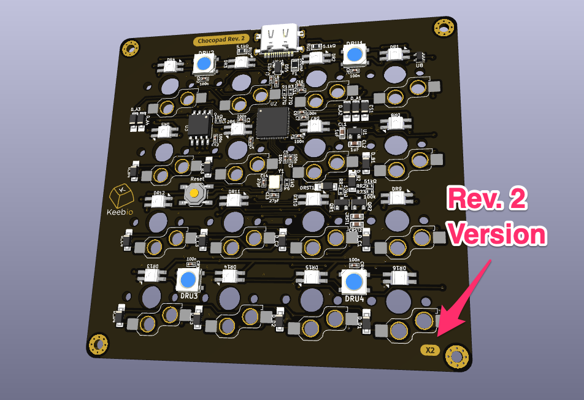

# Chocopad Case

## 3D-Print Files

These files are just for the [Rev. 2 of the Chocopad](https://keeb.io/products/chocopad-16-key-macropad-for-kailh-choc-low-profile-switches) (Hotswap + Per-key RGB) with integrated microcontroller.

### Identifying Version

There are two versions of the Rev. 2 Chocopad PCB, so pay attention to which version you have, as that will affect will case files to use. To identify which version you have, look at the lower-right corner on the back of the PCB, and it will either say `X1` or `X2`.

If you purchased the Chocopad Rev. 2 when it first came out, then you have the X1 version. The latest batch of PCBs is the X2 version, but they have not been released yet.

## Parts Needed

You will need four 8mm or 9mm M2 screws to insert through the bottom plate upwards, all the way to the top shell, which you will screw into.

## License

These case files are released under the MIT License.
